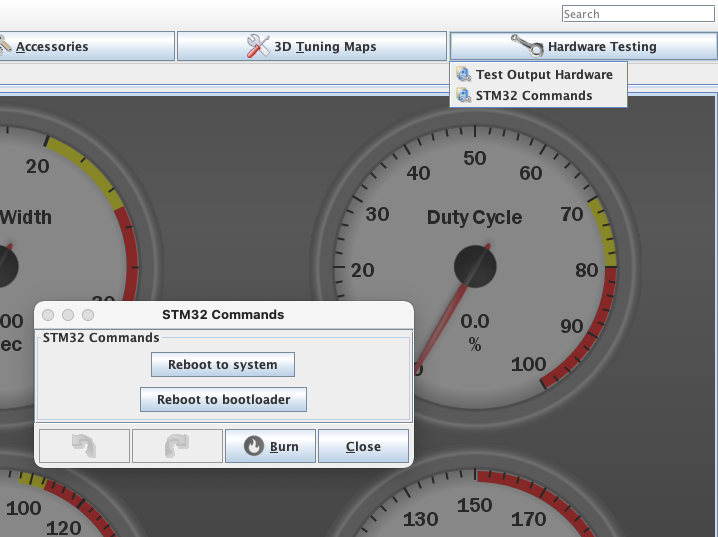
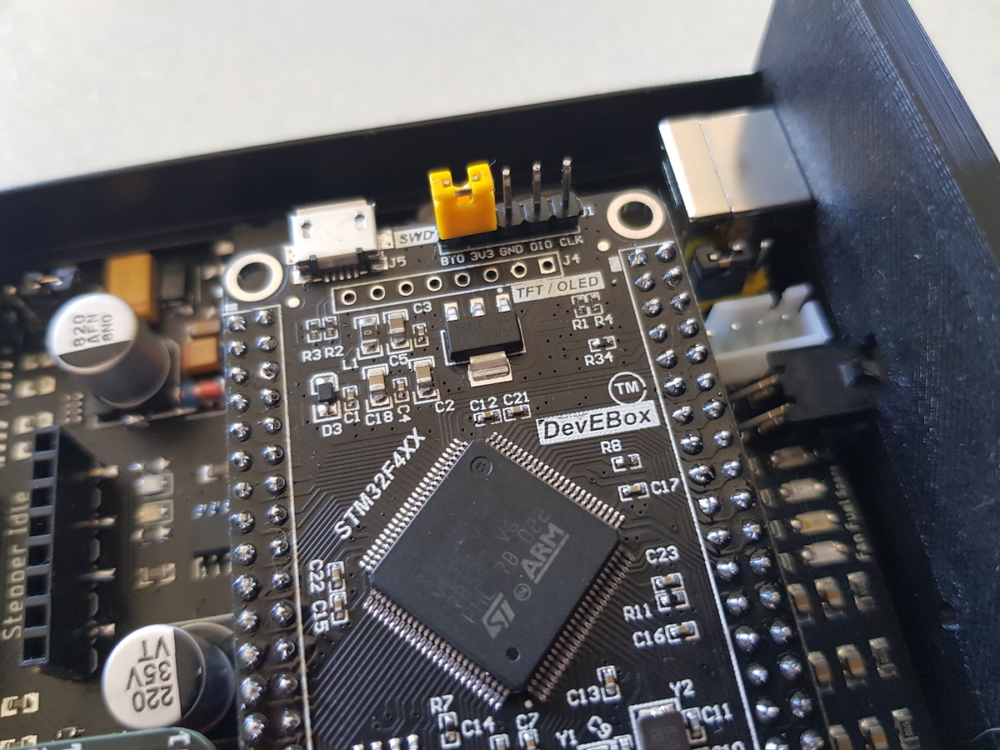
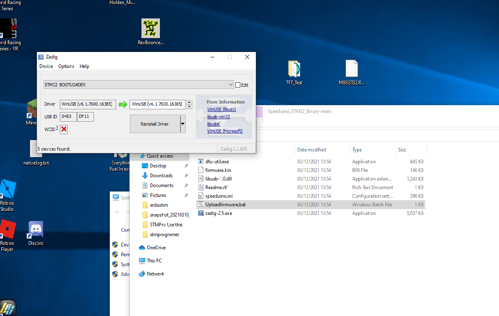

STM32F407 Programer for the STMPRO ECU.

firmware.bin file is Speeduino-DEV 202306.

My Version Compiled 202309. 

This Firmware has Haltech CANBUS broadcasts and is also compatible
to the NEW CABBUS Wide Band Controller.

Only available for windows OS currently.
Zadig-2.5.exe needs to be installed first

Plug the ecu into USB
In Tunerstudio end tab "Hardware testing"
STM32 Commands
You will see a button 
"Reboot to bootloader"

Normally with the ecu connected Tuner studio should go grey and stay that way, if it reconnects it didn't work and you have to try again.

If this doesn't work for you, you can use the manual mode, Using a jumper as shown in the "Manual DFU mode" image.

Once connected in DFU mode.

windows should say something about a stm32 Bootloader. when this happens you need to run Zadig.

View the image in the download to see the settings needed.

Run Zadig

goto options on the top and select list all devices.

then from the dropdown menu select STM32Bootloader.

If you see "Black_f407VE in CDC" its not in DFU mode.

there are to boxes with a arrow inbetween on the right hand side box scroll through untill you see
"Winusb(v6.x.xxxx)"
click reinstall driver.

It should now be ready to program.

run Uploadfirmware.bat and it should open up a dos screen 
identify the cpu and start programing.

once programed unplug ecu and reconnect to TS, Start a new TS Project.

Load the new ini file, Speeduino.ini in this download directory.

When you get the the Project Settings select "Controller in use" as STM32 (Example is in New Project settings image).
